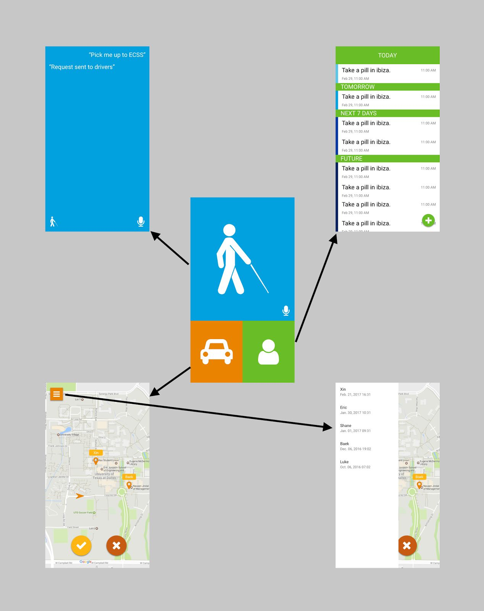
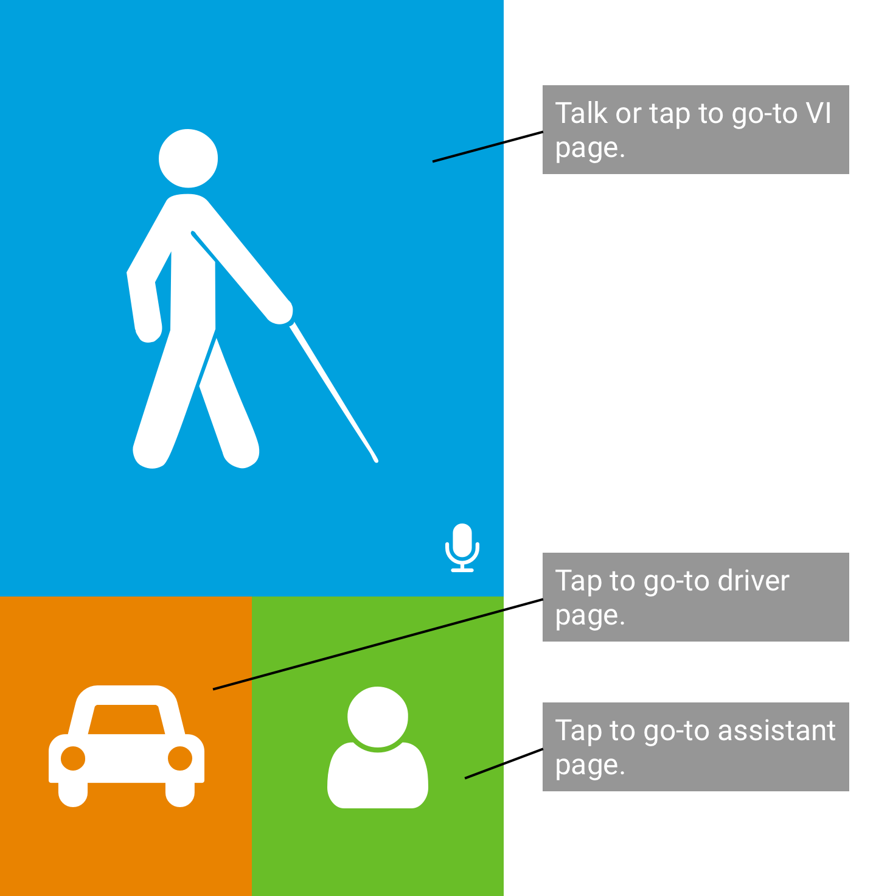
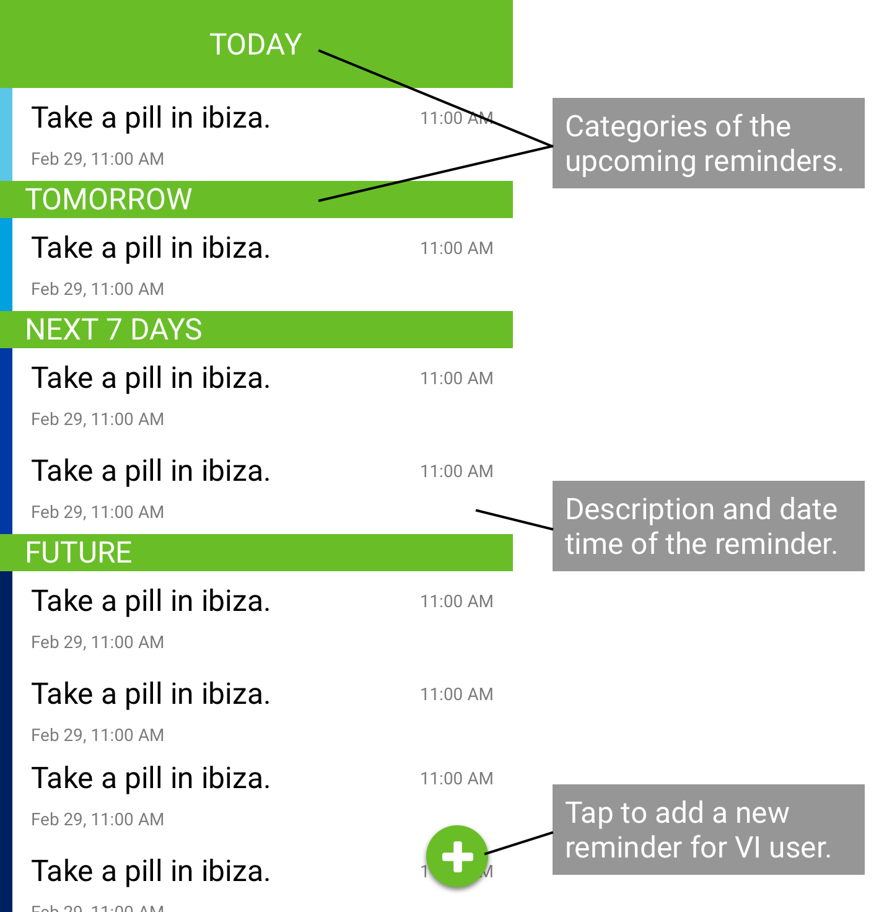
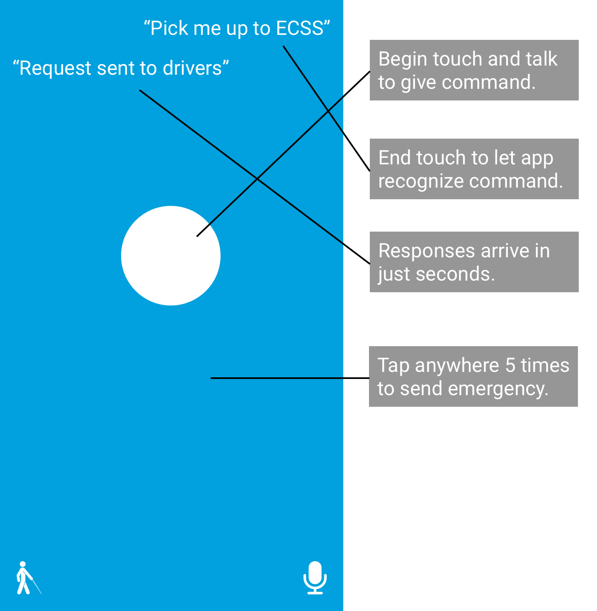
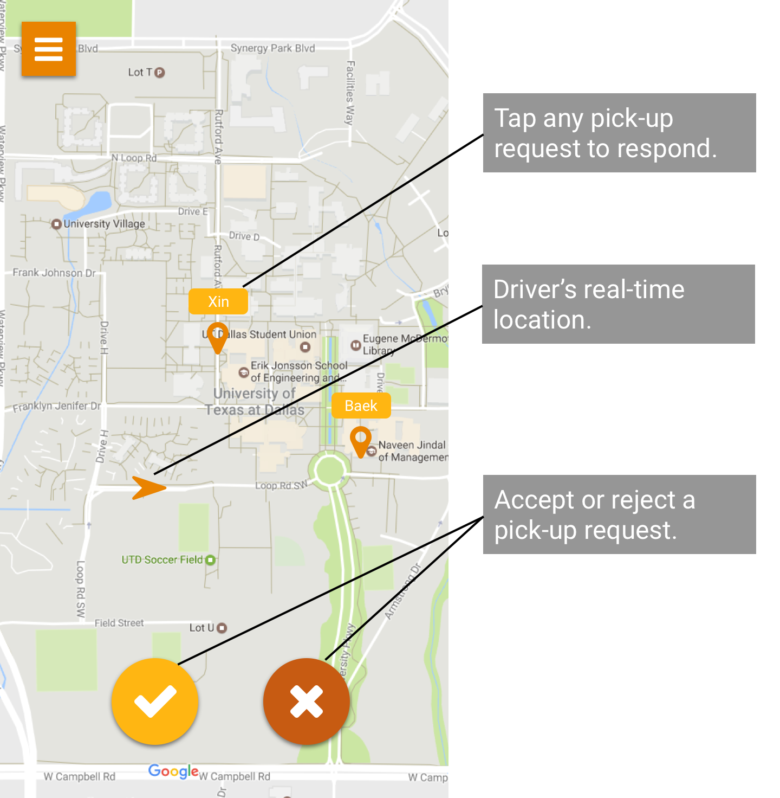
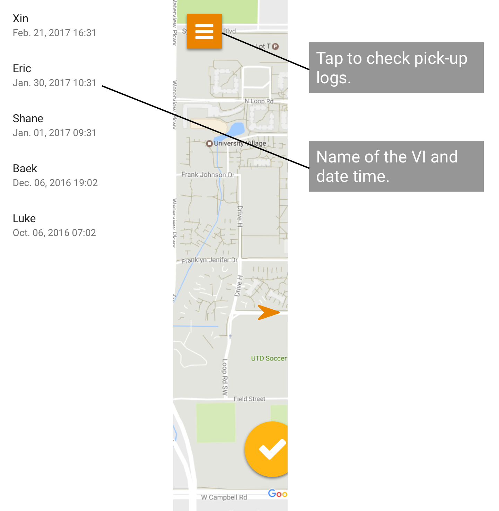

# UVI (Uber for Visually Impaired)

Project Team: Transformers  
Seungtack Baek  
Erick Macias  
Zengtai (Shane) Qi  
Xin Tong  

## INTRODUCTION

This document is the user manual of the software, an iOS app, which is called “Uber for Visually Impaired (here and on, UVI)”.
UVI application has high level functionalities as:

- The visually impaired (VI) person will open the application on his/her smartphone.
- The VI person will state the desired destination building on campus.
- Once user speaks the destination. The system will notify UVI drivers.
- The driver will commit to pickup the VI person.
- The driver will pickup the VI person drop off at the desired destination.
- The assistive person can add reminders for the VI person.
- The VI person will be reminded throughout the day via voice.

## STORYBOARD

## HOME SCREEN

## ASSISTANT SCREEN

## VI SCREEN

## DRIVER SCREEN

